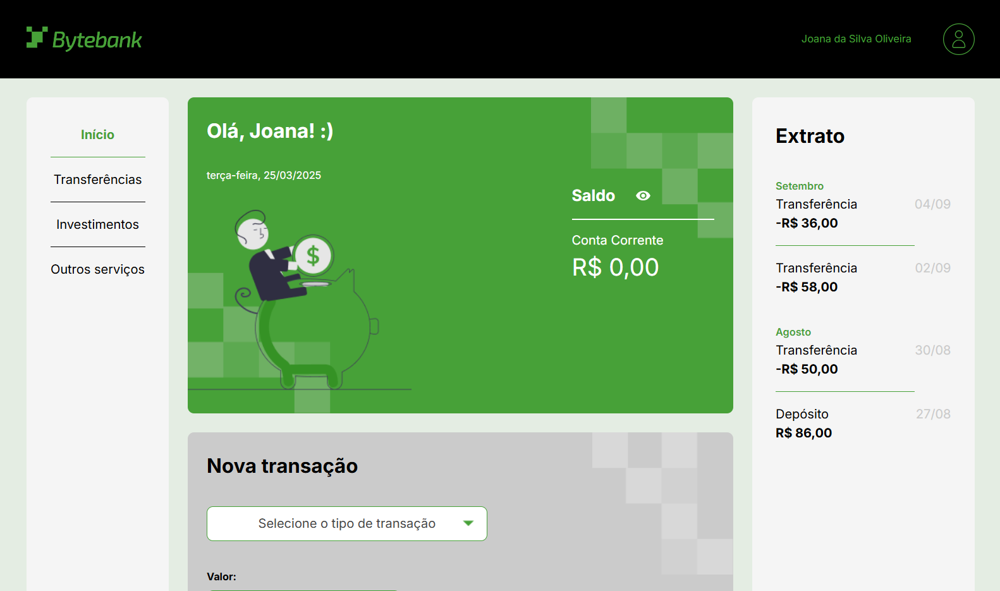

# Bytebank

## ℹ️ Sobre

Projeto utilizado no curso para aprendizado das técnicas e melhores práticas.

## 📘Ementa

### TypeScript na prática: implemente um projeto completo com TypeScript e módulos

- Compreender os fundamentos e conceitos do TypeScript
- Aprender a refatorar e melhorar seu projeto usando TypeScript
- Entender a configuração e compilação do código TypeScript
- Explorar recursos como tipos primitivos, arrays, Type Alias e Enums
- Organizar e divida seu projeto em módulos eficientes

### TypeScript: aplicando orientação a objetos no Front-end

- Compreender as características do paradigma funcional e de orientação a objetos com Typescript
- Aprender a construir classes e métodos
- Saiber como utilizar modificadores de acesso para melhorar a segurança do seu projeto
- Conhecer o conceito de herança para construir novas classes sem repetir código
- Realizar a implementação de validações a partir de decorators

## 🖥️ Tecnologias

  
  
  

## 🧑‍🏫 Instrutor(es)

| [ Neilton Seguins](https://github.com/RodrigoHarder) | [ Mônica Hillman](https://github.com/MonicaHillman) |
| :-------------------------------------------------------------------------------------------------------------------------------------------------------------------------------------------------------------------------------------------------------------------------------------------------------------------------------------------: | :------------------------------------------------------------------------------------------------------------------------------------------------------------: |
## 💻 Screenshot

